# Deepfaking Numbers using Keras
 
 |Discriminator Model|Generator Model|GAN Model|
 | ------------- | ------------- |------------- |
| | 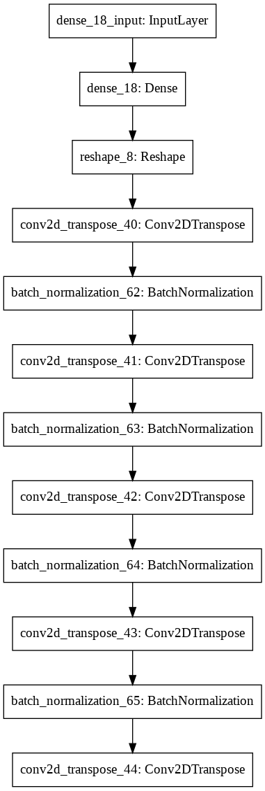||
 
### Number 0
|Accuracy and Loss |Epoch 1|Epoch 99|
| ------------- | ------------- |------------- |                               
|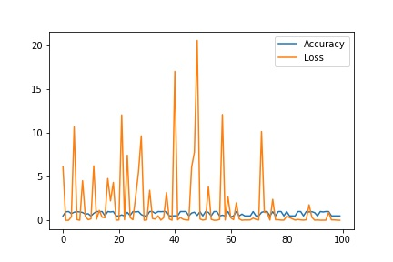||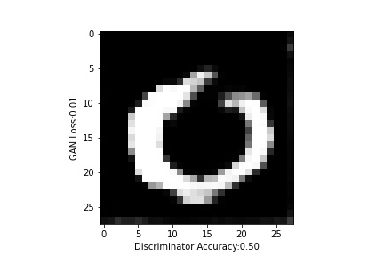|

### Number 1
|Accuracy and Loss |Epoch 1|Epoch 99|
| ------------- | ------------- |------------- |                         
||||

### Number 2
|Accuracy and Loss |Epoch 1|Epoch 85|
| ------------- | ------------- |------------- |                                    
|||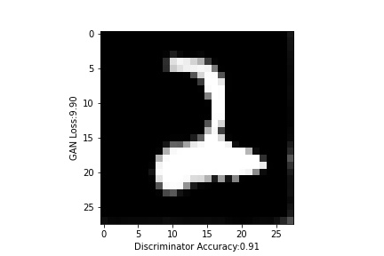|

### Number 3
|Accuracy and Loss |Epoch 1|Epoch 97|
| ------------- | ------------- |------------- |                              
|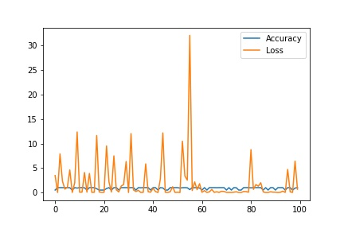|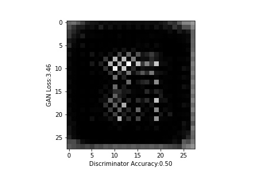||

### Number 4
|Accuracy and Loss |Epoch 1|Epoch 97|
| ------------- | ------------- |------------- |                                    
|||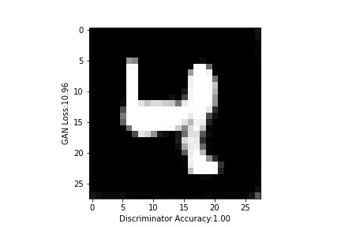|

### Number 5
|Accuracy and Loss |Epoch 1|Epoch 96|
| ------------- | ------------- |------------- |                                     
|||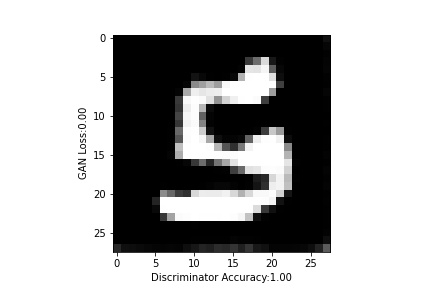|

### Number 6
|Accuracy and Loss |Epoch 1|Epoch 92|
| ------------- | ------------- |------------- |                              
|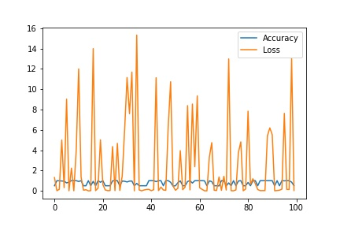|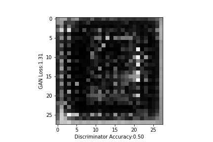||

### Number 7
|Accuracy and Loss |Epoch 1|Epoch 100|
| ------------- | ------------- |------------- |                                     
||||

### Number 8
|Accuracy and Loss |Epoch 1|Epoch 51|
| ------------- | ------------- |------------- |                                
|||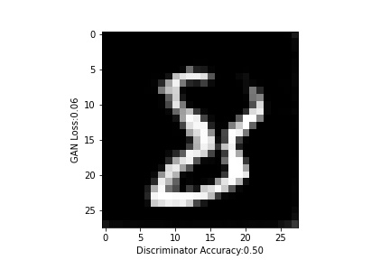|

### Number 9
|Accuracy and Loss |Epoch 1|Epoch 100|
| ------------- | ------------- |------------- |                                  
|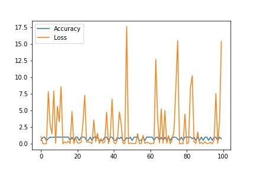|||
