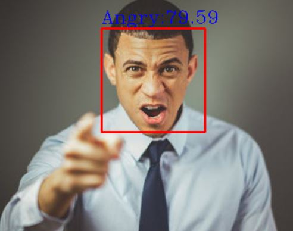
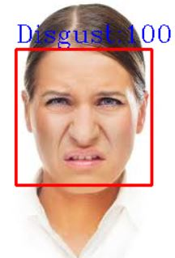
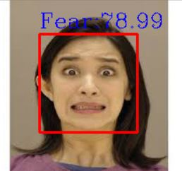
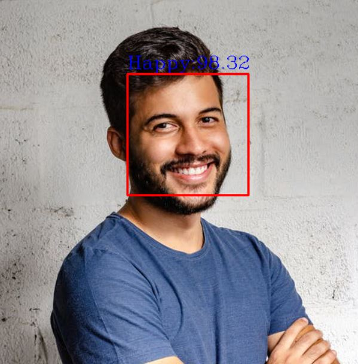
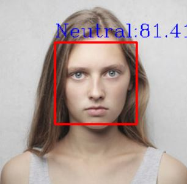
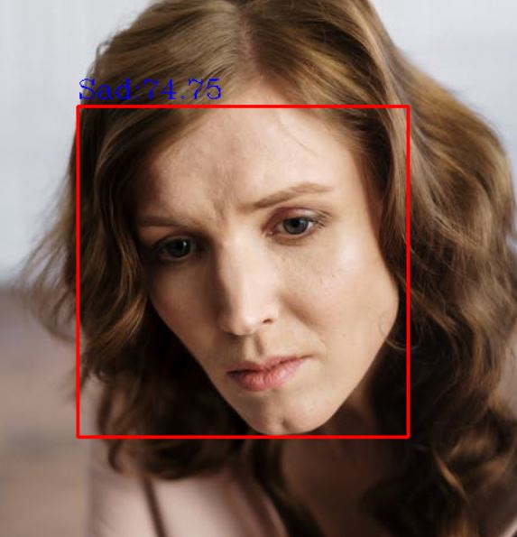
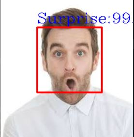
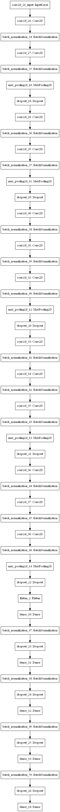
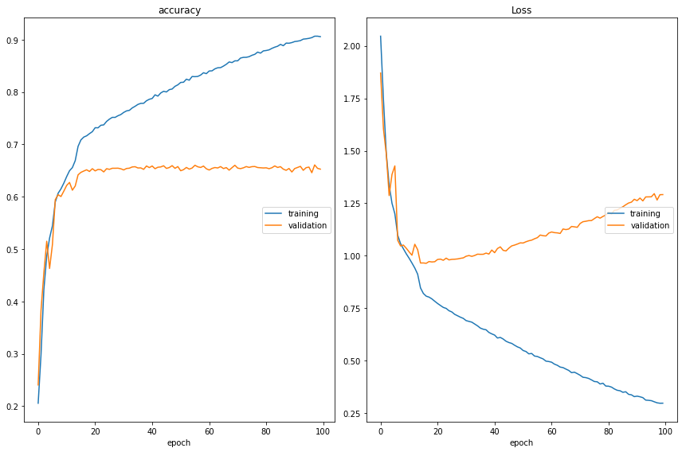

# Facial Expression Recognition

### Angry

### Disgust

### Fear

### Happy

### Netural

### Sad

### Surprise

### Model

### Accuracy and Loss Graph
Use early stopping to avoid validation loss from increasing, in this model I didn't use early stopping. (Probably the model is overfitted)

## 500 Epochs
### Accuracy and Loss Graph
Use early stopping to avoid validation loss from increasing, in this model I didn't use early stopping. (Probably the model is overfitted)

