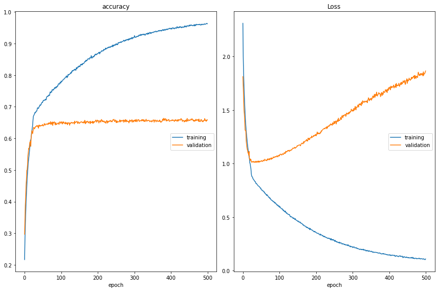

# Facial Expression Recognition

|Angry |Disgust|Fear|Happy|
| ------------- | ------------- |------------- |------------- |       
|||||

|Netural |Sad|Surprise|
| ------------- | ------------- |------------- |
||||

### Model

### Accuracy and Loss Graph
Use early stopping to avoid validation loss from increasing. In this model I didn't use early stopping. (The model is overfitted)

## 500 Epochs
### Accuracy and Loss Graph
Use early stopping to avoid validation loss from increasing. In this model early stopping was not used. (The model is overfitted)

