# Image Denoising using AE

## Mnist Dataset
### Original Dataset
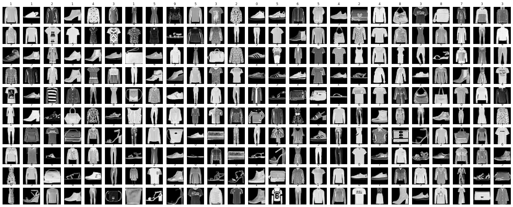

### Noisy Dataset
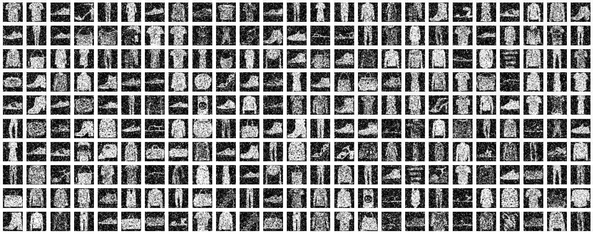

### Model
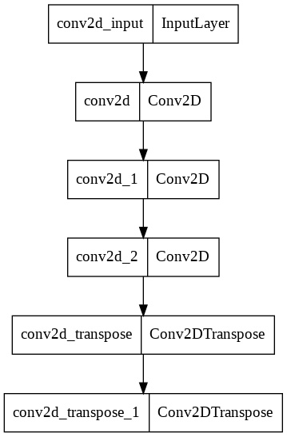

### Loss Graph
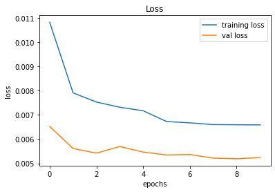

### Model Denoising Predictions
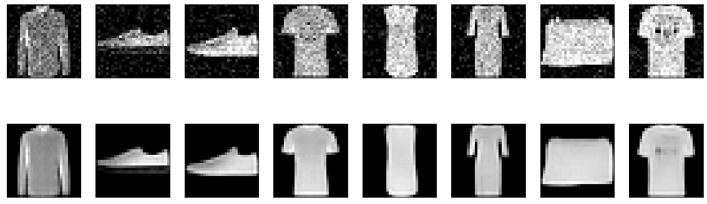

## RGB Dataset with RGB Salt and Peper Noise (amount=0.3)
### Clean and Nosiy Dataset

### Autoencoder Model
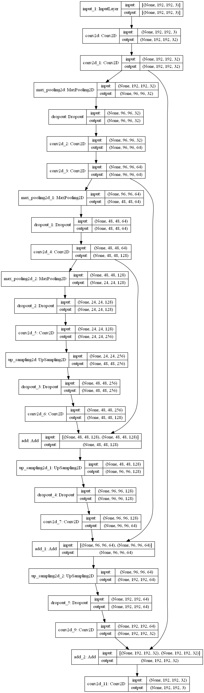

### AE Loss Graph

### AE Accuracy Graph
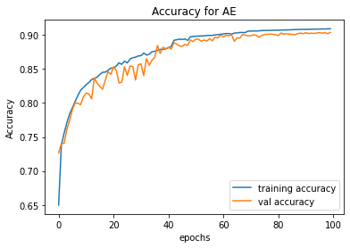

### AE Learning Rate Graph
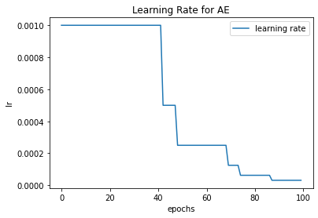

### CNN Model
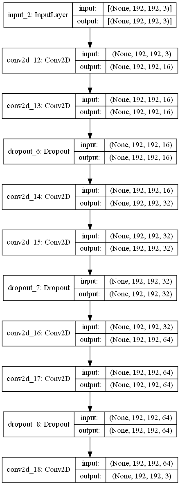

### CNN Loss Graph
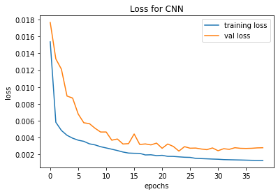

### CNN Accuracy Graph
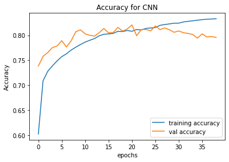

### CNN Learning Rate Graph
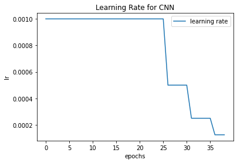

### AE and CNN Model Denoising Predictions
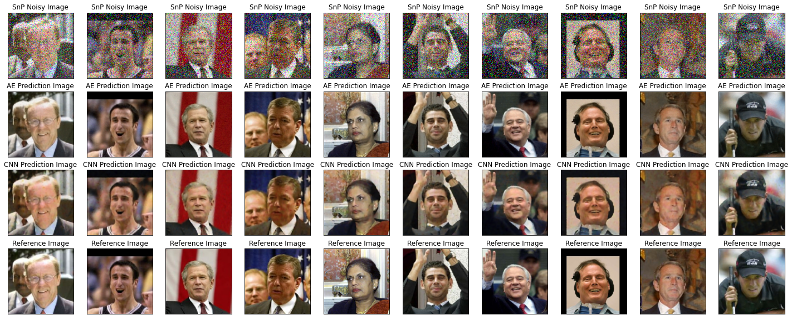

## RGB Dataset with RGB Gaussian Noise (var=0.05)
### Clean and Nosiy Dataset
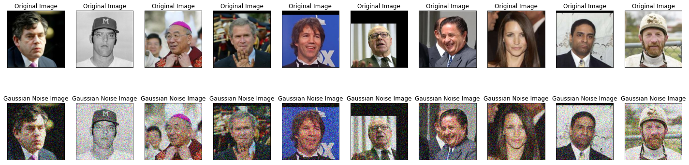

### AE Loss Graph
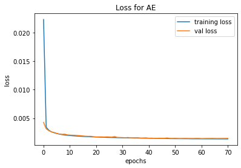

### AE Accuracy Graph
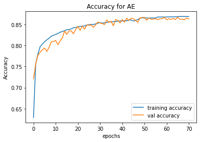

### AE Learning Rate Graph
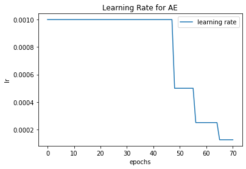

### CNN Loss Graph
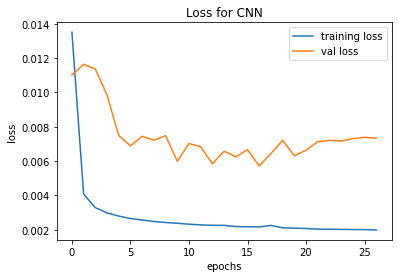

### CNN Accuracy Graph
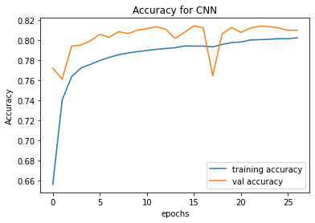

### CNN Learning Rate Graph

### AE and CNN Model Denoising Predictions
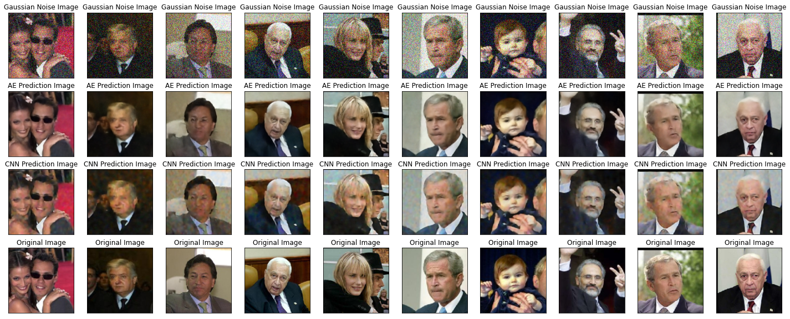

## RGB Dataset with Random Noise
### Clean and Nosiy Dataset
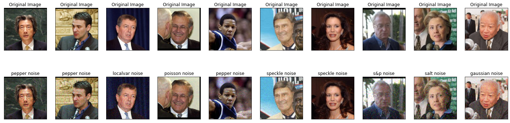

### AE Loss Graph
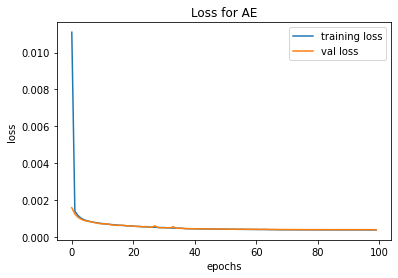

### AE Accuracy Graph
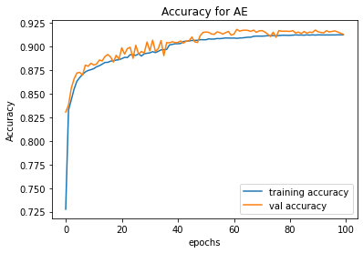

### AE Learning Rate Graph
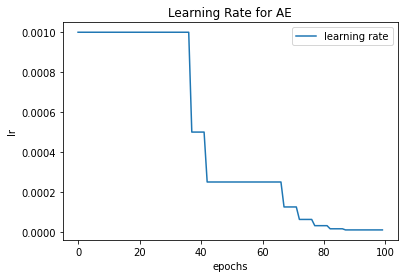

### CNN Loss Graph
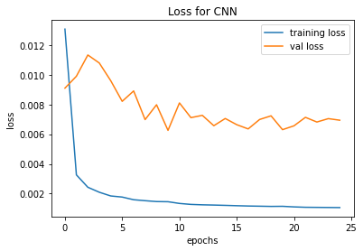

### CNN Accuracy Graph
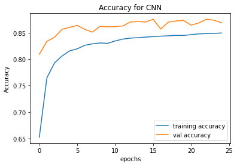

### CNN Learning Rate Graph
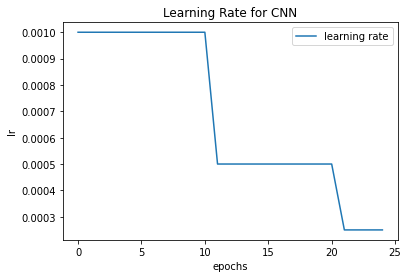

### AE and CNN Model Denoising Predictions
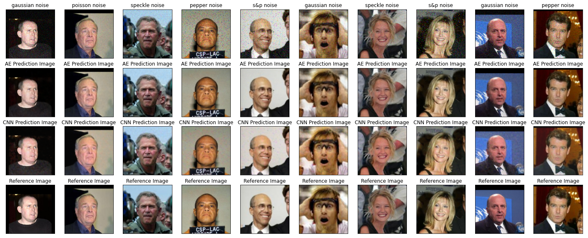
