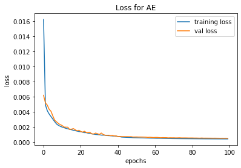

# Image Denoising using AE

## Mnist Dataset
### Original Dataset

### Noisy Dataset

|Model|Loss Graph|
|----------|-----------|
|||

### Model Denoising Predictions

## RGB Dataset with RGB Salt and Peper Noise (amount=0.3)
### Clean and Nosiy Dataset

|Autoencoder Model|CNN Model|
|------------|-------------|
|||
|||
|||
|||

### AE and CNN Model Denoising Predictions

## RGB Dataset with RGB Gaussian Noise (var=0.05)
### Clean and Nosiy Dataset

|Autoencoder Model|CNN Model|
|------------|-------------|
|||
|||
|||

### AE and CNN Model Denoising Predictions

## RGB Dataset with Random Noise
### Clean and Nosiy Dataset

|Autoencoder Model|CNN Model|
|------------|-------------|
|||
|||
|||

### AE and CNN Model Denoising Predictions

