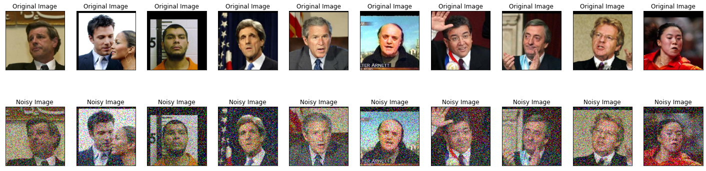
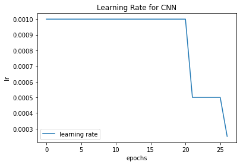

# Image Denoising using AE

## Mnist Dataset
### Original Dataset

### Noisy Dataset

### Model

### Loss Graph

### Model Denoising Predictions

## RGB Dataset with RGB Salt and Peper Noise (amount=0.3)
### Clean and Nosiy Dataset

### Autoencoder Model

### AE Loss Graph

### AE Accuracy Graph

### AE Learning Rate Graph

### CNN Model

### CNN Loss Graph

### CNN Accuracy Graph

### CNN Learning Rate Graph

### AE and CNN Model Denoising Predictions

## RGB Dataset with RGB Gaussian Noise (var=0.05)
### Clean and Nosiy Dataset

### AE Loss Graph

### AE Accuracy Graph

### AE Learning Rate Graph

### CNN Loss Graph

### CNN Accuracy Graph

### CNN Learning Rate Graph

### AE and CNN Model Denoising Predictions

## RGB Dataset with Random Noise
### Clean and Nosiy Dataset

### AE Loss Graph

### AE Accuracy Graph

### AE Learning Rate Graph

### CNN Loss Graph

### CNN Accuracy Graph

### CNN Learning Rate Graph

### AE and CNN Model Denoising Predictions

