# python_games_AI
 
## Original Author's AI for Snake Game
Link : https://github.com/python-engineer/snake-ai-pytorch

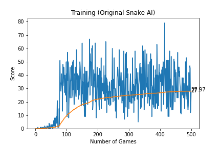

### More States Added to Original Author's AI
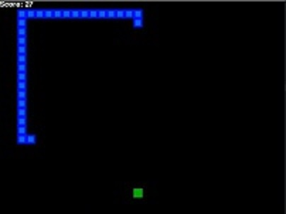 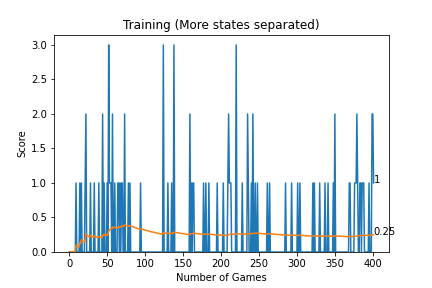

### Wall Passing and More States Added
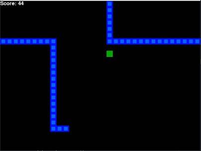
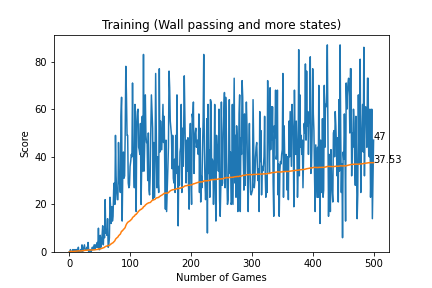

### Wall Passing and States Separated
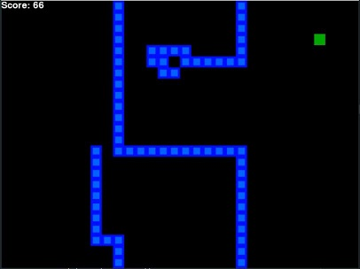
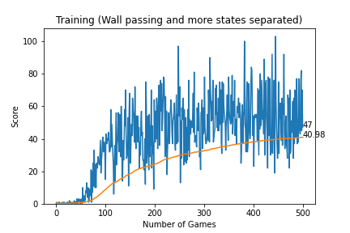

### Wall Passing, States Separated and Obstacle Added
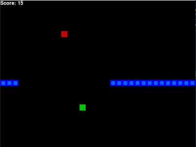
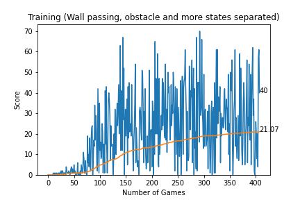

## Car Game AI

AI learns to avoid incoming cars using reinforcement learning. Max score was set to 500 and once it reaches 500 new games starts.

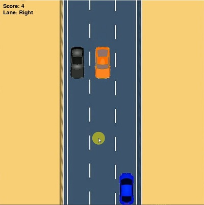
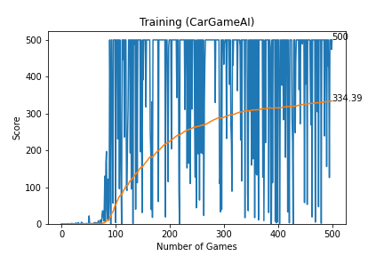
